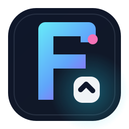
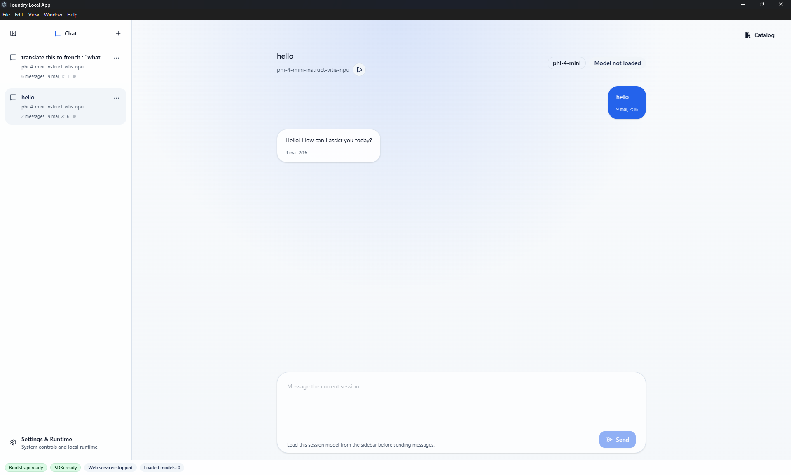
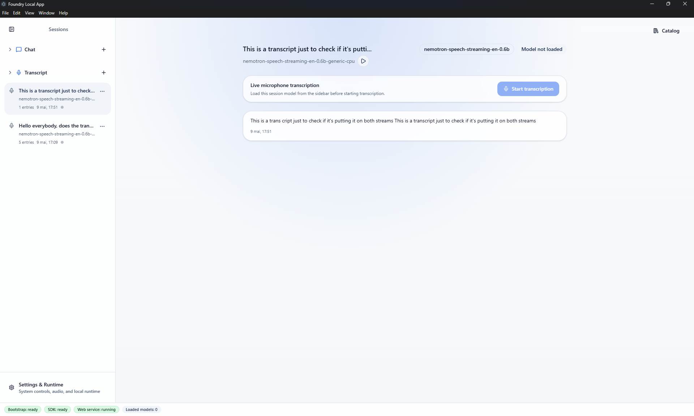
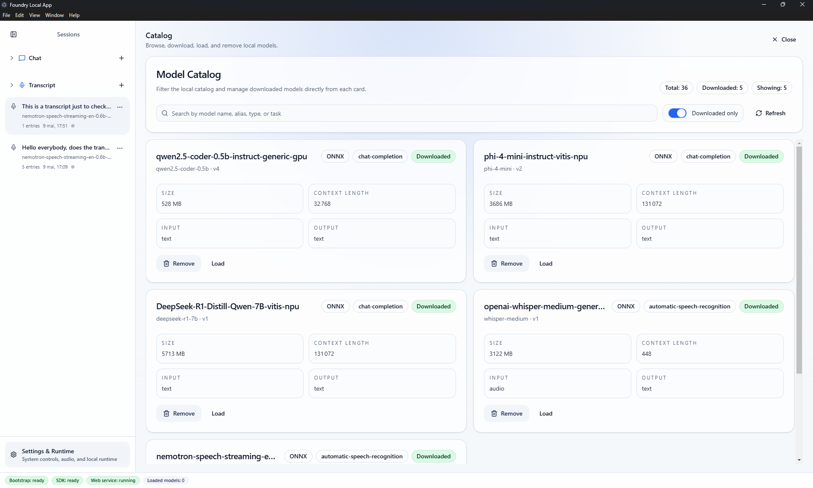
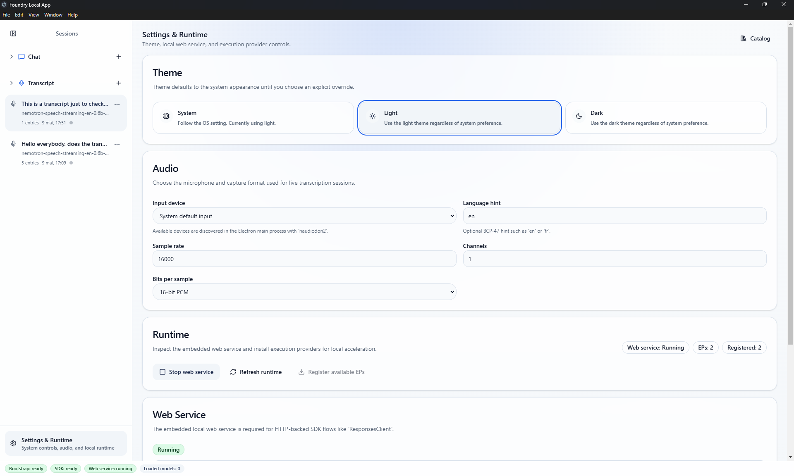

# oundry Local App

[](https://www.electronjs.org/)
[](https://react.dev/)
[](https://www.typescriptlang.org/)
[](https://vite.dev/)
[](./.github/workflows/release.yml)
[](./LICENSE)

Desktop UI for browsing, downloading, loading, and chatting with local models through the Microsoft Foundry Local SDK.

Foundry Local App packages the SDK behind a native Electron shell and a modern React renderer, keeping all Foundry SDK access in the Electron main process and exposing a narrow IPC layer to the UI.

## Overview

- Browse the local Foundry model catalog with rich metadata.
- Download, remove, load, and unload models from the same Catalog experience.
- Manage persisted chat sessions backed by downloaded local models.
- Render Chat assistant responses as Markdown with syntax-highlighted code blocks and one-click copy actions.
- Capture live local audio transcription with persisted transcript sessions and audio settings.
- Inspect runtime status, web service state, and execution provider registration.
- Package the app for Windows as both a portable `.exe` and an installer, then publish them with GitHub Actions.

## Screenshots

### Chat

Run local conversations against downloaded models with persistent session history, clear model state, and richer response rendering.

Chat highlights:

- 💬 Persistent local chat sessions
- 📝 Assistant responses rendered as Markdown
- 🎨 Syntax-highlighted fenced code blocks
- 📋 One-click copy for generated code blocks



### Transcript

Transcribe live microphone audio with local audio-capable models while keeping a dedicated transcript history.

Transcript highlights:

- 🎙️ Live microphone transcription with local models
- 🫧 Separate live preview text during active capture
- 🗂️ Persistent transcript sessions and history
- ⚙️ Quick access to model state and audio settings



### Catalog

Browse the local model catalog, filter to downloaded models, and manage the full model lifecycle from one place.

Catalog highlights:

- 🔎 Rich model discovery and filtering
- 📦 Downloaded-model management in one view
- ▶️ Load and unload actions with clear status
- 🧾 Metadata for model capabilities and variants



### Settings And Runtime

Control the app experience and local runtime from a single administration surface.

Settings and Runtime highlights:

- 🌗 Theme preference controls
- 🌐 Embedded web service start and stop controls
- 🧩 Execution provider registration and status
- 🎛️ Runtime and audio configuration in one place



## Tech Stack

- Electron
- React 19
- React Router with `HashRouter`
- Vite
- TypeScript
- Tailwind CSS v4
- shadcn/ui
- `foundry-local-sdk`

## Project Structure

```text
.
|- src/main.ts                 Electron main process entry
|- src/preload.ts              Preload and IPC bridge
|- src/renderer/               React renderer app
|- docs/                       README screenshots
|- build/                      App icon sources
|- scripts/                    Packaging and asset generation scripts
|- electron-builder.config.mjs Windows packaging config
`- .github/workflows/          CI and release automation
```

## Getting Started

### Prerequisites

- Windows 11 or Windows 10 with Foundry Local SDK prerequisites installed
- Node.js 22+
- npm 10+

### Install

```bash
npm install
```

### Run The App

```bash
npm start
```

This builds the Electron main process and the Vite renderer, then launches the desktop app.

## Available Scripts

```bash
npm run build              # Build main and renderer bundles
npm run build:main         # Build Electron main/preload only
npm run build:renderer     # Build renderer only
npm run dev:renderer       # Run the Vite renderer dev server
npm run assets:icons       # Generate Windows icon assets
npm run dist:win:unpacked  # Build a packaged unpacked Windows app
npm run dist:win:portable  # Build the portable Windows executable
npm run dist:win:installer # Build the NSIS Windows installer
npm run dist:win:release   # Build both Windows release artifacts
```

## Architecture Notes

- The renderer never imports `foundry-local-sdk` directly.
- Foundry Local SDK state lives in the Electron main process.
- The renderer consumes serialized state over IPC through `src/preload.ts`.
- Routing uses `HashRouter` because the renderer is loaded from `file://`.
- The current product flow centers on Catalog, Chat, Transcript, Runtime, and Settings.

## Building Windows Packages

### Unpacked Electron App

```bash
npm run dist:win:unpacked
```

Output:

- `release/win-unpacked/`

### Portable Windows EXE

```bash
npm run dist:win:portable
```

Output:

- `release/foundry-app.exe`

The portable packaging flow does the following:

1. Generates branded Windows icon assets.
2. Builds the Electron app and renderer bundles.
3. Packages the app as a self-contained portable Windows executable.

### Windows Installer

```bash
npm run dist:win:installer
```

Output:

- `release/foundry-app-setup.exe`

The installer flow does the following:

1. Generates branded Windows icon assets.
2. Builds the Electron app and renderer bundles.
3. Packages the app as an NSIS installer.

## GitHub Release Pipeline

This repository includes a Windows release workflow at `.github/workflows/release.yml`.

It runs when a tag matching `v*` is pushed and will:

1. Install dependencies.
2. Build the Electron app.
3. Generate both the portable `.exe` and NSIS installer artifacts.
4. Upload both files to the corresponding GitHub Release.

No special signing or MSIX-specific GitHub secrets are required for this portable release flow.

## Product Scope

Implemented or actively targeted:

- Catalog browsing and local model management
- Downloaded-model filtering and loaded-state badges
- Persisted local chat sessions
- Markdown chat rendering with syntax-highlighted code blocks and easy copy/paste
- Live audio transcription with persisted transcript sessions
- Runtime and web service controls
- Execution provider discovery and registration

Planned follow-up work includes:

- model details and variants
- update and version awareness
- structured output playground

The implementation roadmap lives in `.features/README.md`.

## Development Notes

- There is currently no dedicated lint or test pipeline in this repo.
- The primary project-level verification command is `npm run build`.
- For packaging validation, use `npm run dist:win:release` on Windows.

## License

MIT
